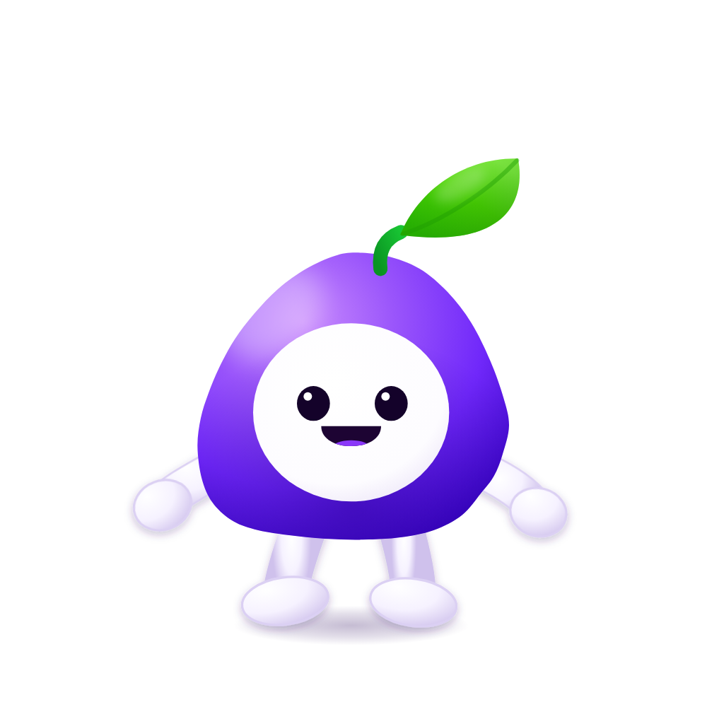

# Grape mascot — hop &amp; leaf drop

A looping mascot animation for the purple grape character, rebuilt as vector art so
every part is rigged and re-renderable. It mirrors the beats of the reference bear
animation (idle bounce → big jump → the ears fall off → shocked stare), with the
grape's leaf standing in for the bear's ears.



## The loop (2.6s, seamless)

| time | beat |
|------|------|
| 0.00–1.05s | two idle hops — squash on landing, arms swinging, one blink |
| 1.05–1.22s | crouch, arms tucked back |
| 1.22–1.70s | big jump: body stretches, arms fling out, mouth opens |
| ~1.44s | the leaf pops off the top and tumbles away |
| 1.70–1.90s | landing squash with dust puffs, leaf still falling |
| 1.90–2.38s | leaf lands beside the feet; wide-eyed stare, lean, shivers |
| 2.38–2.60s | the leaf spins back onto the head and the smile returns |

## Files

| file | what it is |
|------|-----------|
| `grape-animation.html` | the animation itself — self-contained SVG + JS, no dependencies |
| `grape-animation.mp4` | 1000×1000, 30fps, three loops, white background |
| `grape-animation-dark.mp4` | same on black, to match the original character art |
| `grape-animation-alpha.webm` | VP9 with a transparent background, for overlays |
| `grape-animation.gif` | 440px looping GIF for chat/README use |
| `poster.png` | first frame, as a still |
| `render.mjs` | renders the page to a PNG frame sequence (headless Chromium) |
| `export.sh` | frame sequence → mp4 / webm / gif |

## Preview

Open `grape-animation.html` in a browser. Query parameters:

- `?bg=dark` — black background, `?bg=none` — transparent
- `?frame=1.45` — freeze on one moment of the timeline (seconds)

## Re-export

```bash
# needs node with playwright available, plus ffmpeg
./export.sh                       # uses `ffmpeg` from PATH
FFMPEG=/path/to/ffmpeg ./export.sh
SIZE=1400 FPS=60 LOOPS=2 ./export.sh
```

## Editing the animation

Everything lives in `grape-animation.html`:

- **Artwork** — plain SVG in the document body. The body silhouette is one path,
  the face/eyes/mouth/leaf/limbs are separate elements so they can be posed.
- **Timing** — the `P` table in the script holds the phase boundaries in seconds,
  `T` is the loop length, `T_DETACH` / `T_LEAFHIT` control the leaf gag.
- **Motion** — `state(t)` returns the full pose for any time `t`; `render(t)` writes
  it into the SVG. Nothing is time-dependent beyond `t`, so any frame can be drawn
  on demand (that is what the exporter relies on).

Colours are sampled from the source character render: body `#b86ffb → #7028fa →
#3602c0`, face `#ffffff`, eyes `#14022a`, tongue `#8a37f9`, leaf `#8bf04a → #2bb903`,
stem `#12b02c`.
