# Grape mascot — walking loop

A walk-cycle animation of the grape mascot, for use as a loading screen.

| File | What it is |
|------|------------|
| `grape-walk.svg` | The character. Self-contained animated SVG — all CSS lives inside the file, no external fonts or assets. |
| `grape-loading.html` | A complete loading screen built around it. |
| `build_loading_page.py` | Regenerates `grape-loading.html` from `grape-walk.svg`. |

`grape-walk.svg` is the source of truth for the character; `grape-loading.html`
embeds a copy of it. After editing the SVG, run:

```bash
python3 assets/mascot/build_loading_page.py
```

## Using the SVG

It animates in an `` tag, as a CSS `background-image`, or inlined:

```html

```

Inline it instead if you want to theme it. The character exposes CSS custom
properties on its root `<svg>` element:

| Property | Default | Controls |
|----------|---------|----------|
| `--grape` | `#A342DE` | Body, limbs, shoes |
| `--grape-hi` | `#C77BF0` | Shoe soles |
| `--deep` | `#3E1263` | Eyelids, inside of the mouth |
| `--ink` | `#1A1220` | Outlines, pupils, ground shadow |
| `--leaf` / `--vine` | `#35B024` / `#3DC42B` | Leaf, stem, tendril |
| `--tongue` | `#E01E6E` | Tongue |
| `--cycle` | `0.92s` | Length of one full stride (two steps) |
| `color` | `#8A7C96` | The scrolling road dashes |

```html
<svg style="--cycle: 1.4s; --grape: #7B2FB5; color: #ccc"> …
```

## How the walk is built

Each leg is a straight tube with the shoe parented to it. `scaleY` on the leg
shortens it as the knee comes toward the viewer, and the shoe's own keyframes
apply the exact inverse scale so it never squashes. Each leg is in stance for
0–58% of the cycle and in swing for the rest; the right leg runs the same
curves half a cycle out, so exactly one foot is off the ground for 80% of the
loop. The body rides low at each foot contact and rises through mid-stance,
arms counter-swing, the leaf lags slightly behind the body, and dust puffs
fire on each plant.

`prefers-reduced-motion: reduce` drops the walk to a slow idle bob.

## Note on the loading page

`grape-loading.html` uses Baloo 2 from Google Fonts for the headline, with a
system fallback stack. If the page is ever served from the device itself
(offline), the fallback is what renders — the character is unaffected either
way, since the SVG carries no font dependency.
