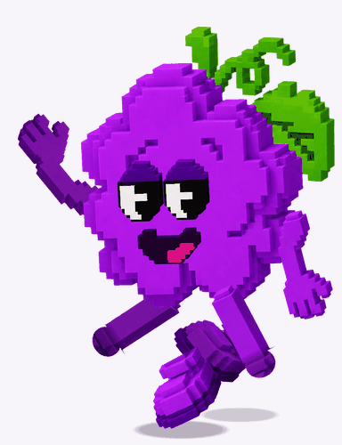

# Voxel grape — swagger walk

The walk from `Bud_Leaf_2.json` (an After Effects / Lottie export), retargeted
onto the voxel grape's parts sheet.



53 frames at 30 fps — one stride, walking left, looping.

## Where the motion comes from

`extract_ref.py` loads the Lottie in headless Chromium with lottie-web, steps
it a frame at a time, and reads each layer group's **composed transform matrix**
straight off the rendered SVG. That sidesteps re-implementing bezier keyframe
interpolation and layer parenting — what comes back is the body, head, arm and
sprig motion exactly as it was authored, landing in `ref_curves.json`.

What that gave us, and what the voxel version keeps:

| From the reference | |
|---|---|
| 53 frames, 30 fps, one stride | the loop length |
| four body bobs per stride | a double bounce — the strut, not a normal walk |
| lean ramping −3° → −13° → −3° | one slow sway across the whole loop, not per step |
| one arm held up, one sweeping 0° → 103° → 0° | a single slow gesture, not an arm swing |
| head drifting ±26px against the body | the face leads, then lags |
| eyes change on frames 22–29 | the expression beat |
| contact shadows on frames 0–3, 22–31, 48–52 | when a foot lands hard |

## What had to change

**The legs.** The reference animates them by morphing a noodle outline — the
shin curves through an S and the foot rolls off the toe. A voxel shin is a
rigid column, so the legs are re-solved as one-bone IK against the same stride
length, stance/swing split (24 frames planted, 29 swinging) and contact phasing
(one foot at frame 0, the other at 26). The shin stretches to reach each foot
instead of bending, and ends in a disc centred on the ankle pivot so the shoe
can roll without ever uncovering the cut.

The reference's full 255px stride, reached by curving, reads as the splits on a
straight column — it is pulled back to 58%. The arm sweep is likewise scaled to
50%: a rigid arm swung the full 103° lies across the character's own face.

**The raised arm.** The reference points with an extended index finger. The
parts sheet has no pointing hand, so the hanging arm is rotated up instead —
close in silhouette, and it holds the same beat.

**Part scales.** The parts sheet lays each piece out at whatever size suited
the layout, not at assembly scale — the body is drawn noticeably smaller
relative to the limbs than it appears assembled. So body, legs, arms, sprig and
face each carry their own scale, measured against the hero render (shin width,
body extent, sprig bbox, sclera and tongue spans). `pose_check.py` puts the
assembled rig next to the hero render for exactly this.

## Output

| File | What it is |
|---|---|
| `out/grape_swagger.gif` | the loop, matted on a light background, 384 × 500 |
| `out/grape_swagger.webp` | same animation, real alpha channel |
| `out/grape_swagger_sheet.png` | sprite sheet, 8 × 7, transparent, 230 × 300 per cel |
| `out/frames/swagger_NN.png` | the 53 frames on their own, full size |
| `parts/` | all 21 cut-outs from the sheet |

The frames and the one-row strip are not checked in — `python3 build.py`
writes them back out.

## Rebuilding

```bash
pip install pillow numpy
python3 build.py                       # frames + gif + webp + sheet
python3 pose_check.py <hero_render.png>  # calibration comparison
```

Re-reading the reference needs a browser and the Lottie player:

```bash
pip install playwright
npm pack lottie-web@5.12.2 && tar xzf lottie-web-*.tgz
cp package/build/player/lottie.min.js .
python3 extract_ref.py                 # rewrites ref_curves.json
```

`extract_parts.py <sheet.png>` only needs re-running if the parts sheet
changes; `parts/` is checked in.

Gait tuning lives at the top of `swagger.py` — `STRIDE`, `LIFT`, `NEAR_DX`,
`SWEEP_GAIN`, `ARM_UP`, `HEAD_GAIN` — alongside the per-part scales.
